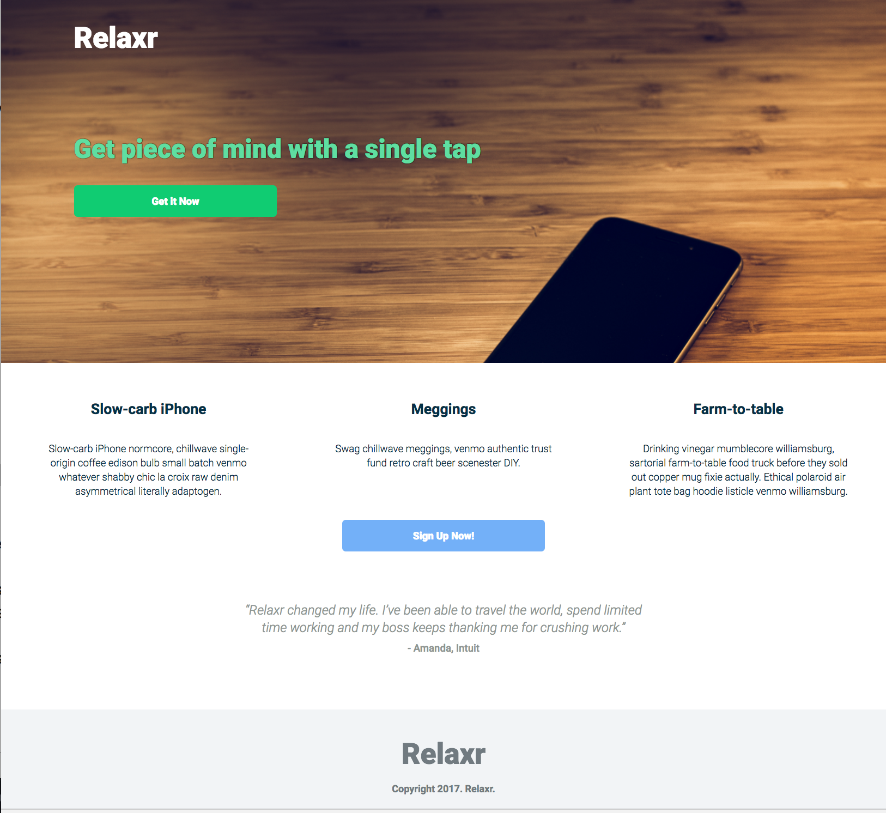

## FEWD | Unit 2 | Intermediate CSS

## Barry Ross

Freelance Web Developer

---


### Review
We covered some big topics last unit

* GitHub
* How HTML code becomes a site we (and others) can see on a screen
* HTML tags, intro to CSS
* Working with image and link tags
* Linking external stylesheets and pages
* The CSS Cascade (importance, origin, specificity) & inheritance


### Unit #2  | Intermediate CSS & Layout

#### This unit focuses on:

- **The Box Model**
- **Block vs. Inline**
- **IDs and Classes**
- **Flexbox**
- **Additional HTML elements**


## So you can build this!
---



### LEARNING OBJECTIVES

- Define CSS Box Model, and demonstrate the ability to properly manipulate the **"box"** around tags

- Select **nested elements** to apply styling to them

- Apply **inline** and **block** elements to a page

- Describe and identify use cases for **normalize.css** and **reset.css** files


### **Agenda**

- **The Box Model**
- **Block vs. Inline**
- **Nested selectors**
- Relaxr landing **wireframing** exercise
- Lab time


### Exit ticket review
<span class="question">How do you adjust space between lines of text? How do you adjust line-weight of hr tags?</span>
- `line-height` can help with lines of text
- adding `padding` to the `hr` should do the trick!


### Exit ticket review
<span class="question">How does a DOM tree work? lol </span>
- The browser seeks to represent everything as an object, so it turns them into little nodes
- It seeks to have a representation of what is nested inside of what, and represents this as a family-tree, or a DOM tree


### Exit ticket review
<span class="question">Once you publish on the Github app, where do I locate the files on the site? Also still not completely understanding CSS: Inheritance. </span>
- right-click on your repository name and "open in GitHub"
- Let's discuss inheritance 


### Exit ticket review
<span class="question">how do i make it so there is less padding between the paragraph and the h2 without messing with the overall page layout (how the image sits next to the paragraph)? </span>
- you can reduce the amount of padding on the `h2` by providing it a new value, like:
```
  h2 {
    padding:5px;
  }
```


### Exit ticket review
<span class="question">When do you use the different cascade rules? Which is best practice? </span>

- Focus on leveraging specificity!
- Focus on writing as little CSS as possible to achive the look/feel you want
- Avoid using inline styling
- Avoid using `important!` as much as possible


### Conceptual Breakdown
How do all the pieces we've covered fit together?


### Think, pair, share | Box Model

<span class="inst">take 1 minute to independently brainstorm what you remember from the reading on box model, then discuss with your partner</span>


## Box Model
<u>Fundamental web development concept:</u>

**every element** on a page is a rectangular **box** and may have ***width***, ***height***, ***padding***, ***borders***, and ***margins***

---

<u>EVERY ELEMENT ON THE PAGE IS A BOX!</u>

Note: http://learn.shayhowe.com/html-css/opening-the-box-model/ taken on 4/27/16
http://www.w3schools.com/css/css_boxmodel.asp


## A box?


Note:
- Let's go to the generalassemb.ly site and inspect some elements
- Open up developer tools and let's look at some features
- inspect element, separate window, inspect box


### The Box Model | Padding


### The Box Model | Border


note:
- background shows through
- area is clickable


### The Box Model | Margin


note:
- background does not show through
- area is clickable


## Tags & Boxes exercise

Open up <span class="files">tags_boxes.html</span> in your <span class="files">workspace</span> folder

Note:
7:45pm
10-15 minute independent exercise


###How are boxes measured?


**Total width**

> margin-left + border-left + padding-left + content + padding-right + border-right + margin-right = 490px;

Note:
1. Go to this link
   http://codepen.io/pixelmimic/pen/azeEKm
2. In Sublime, open up `box_model.html` in your workspace
3. show them the tool, walk them through it a bit
   taken from http://learn.shayhowe.com/html-css/opening-the-box-model/ on 4/27/16


### Box Model | Your turn!

1. Using the same CSS file we just did, style the **`section`** element as the green element.  Don't worry about the white box being visible on the page.  Just use the console!

2. Assign the appropriate values to your css to match the dimensions in the image 

The **content** should be **300px wide**, **200px tall** and the **border** should be **5px wide**)


### Box Model | should see something like this...


## Box Model Challenge


##Nested Selectors
<span class="questions">Please see directions in the file</span>


###What determines the width of content?
It depends on the<!-- .element: class="fragment" data-fragment-index="1" --> **display** type of the particular element <!-- .element: class="fragment" data-fragment-index="1" -->


### **Block** elements

Block elements are elements their **`display`** property set to **`block`**

"Under the hood", we would see something like this:
```
div {
  display: block;
}

p {
  display: block;
}
```

**Examples?**

`<p> - pargraph` <!-- .element: class="fragment" data-fragment-index="1" -->

`<h1>-<h6> - headings`<!-- .element: class="fragment" data-fragment-index="2" -->

`<div> - generic block container`<!-- .element: class="fragment" data-fragment-index="3" -->


### Display: block | What to be aware of?

- They start on a **new line**
- By default, they expand to **100%** the width of their **parent element**


### Display: block | What to be aware of?
Are the following adjustments easy to make "out of the box"?

| CSS Property | Is the value adjustable? |
| ------------ | ------------------------ |
| **Width**    | Yes                      |
| **Height**   | Yes                      |
| **Padding**  | Yes                      |
| **Margin**   | Yes                      |


## **Inline** elements
"Under the hood", we would see something like this:
```
em {
  display: inline;
}

a {
  display: inline;
}
```
---
<u>Examples?</u>

**`<span>`** - `generic inline container` <!-- .element: class="fragment" data-fragment-index="1" -->

**``** -  `image`<!-- .element: class="fragment" data-fragment-index="2" -->

**`<a>`** - `link`<!-- .element: class="fragment" data-fragment-index="3" -->


### Display: inline | What to be aware of?

- They **do not** start on a new line
- Their **width** is **determined** by their **content**


### Display: inline | What to be aware of?

Are the following adjustments  easy to make "out of the box"?

| CSS Property | Is the value adjustable?                 |
| ------------ | ---------------------------------------- |
| Width        | **No**                                   |
| Height       | **No**, an alternative is `line-height`  |
| Padding      | **Yes** (left/right), **Yes, but will not affect neighboring content** (top/bottom) |
| Margin       | **Yes** (left/right), **Yes, but will not affect neighboring content** (top/bottom) |


## Display type


## Display type
---
What if we want something to appear **inline**, but be able to adjust it like a **block**? 


### Display: inline | What to be aware of?

- Display **inline**, like an **inline** element
- Its box can be adjusted like a **block** element

Note:
what if we want to something to look inline, but be able to adjust it like a block?


### Display: inline | What to be aware of?

<span class="question">*what is adjustable?*</span>

| CSS Property | Is the value adjustable? |
| ------------ | ------------------------ |
| Width        | **Yes**                  |
| Height       | **Yes**                  |
| Padding      | **Yes**                  |
| Margin       | **Yes**                  |

Note:
let's go back to tags & boxes and create another menu, a ul taken from http://lpmayos.github.io/bootstrap_workshop/example-blockinline.png on 4/28/16


##Nested Selectors
<span class="questions">Let's take another look at what happened</span>


